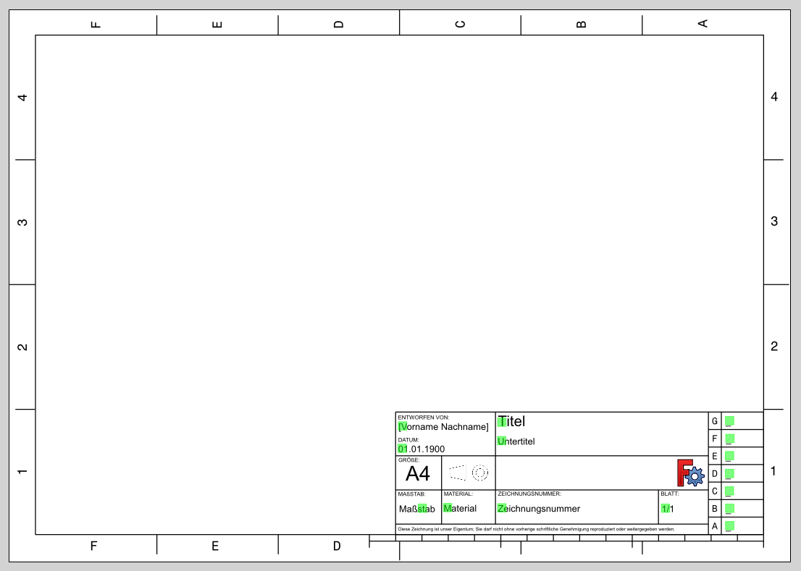
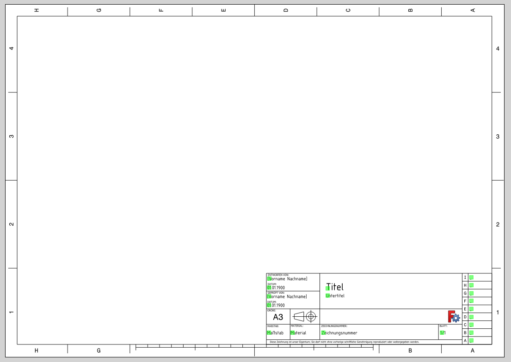

# FreeCAD-TechDraw-Templates

## Getting Started
1. Download TechDraw Template from this repository
2. Create a new page using **Insert Page using Template** and import this template
3. Fill out all the editable fields by clicking on the green squares

## TechDraw A4 Template (Deutsch/German)

## TechDraw A3 Template (Deutsch/German)

